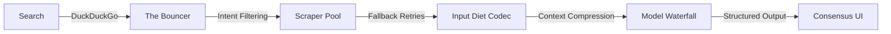

# Agentic Search Pipeline 🕸️

**A resilient, production-grade AI research system built for the Agentic Search Challenge.**

This system was completely re-architected from a basic scraper into a highly resilient node-traversal pipeline. It autonomously executes queries via DuckDuckGo, performs semantic noise reduction, applies an aggressive "Input Diet" to scraped context, and leverages a tiered model waterfall (Gemini Flash & Lite) to strictly output deterministic Pydantic schemas. 

## Visual Architecture



## Core Engineering Challenges & Solutions

### 1. Anti-Bot Protections & CAPTCHA Walls
**The Problem:** Traditional enterprise directories (e.g., Yelp, TripAdvisor, G2) aggressively block headless scrapers with JS rendering hurdles and CAPTCHA loops.
**The Agentic Solution — "The Bouncer":** We implemented a **Dynamic Domain Router** (`filter_clean_urls`) that preemptively analyzes the semantic bounds of the query intent (Food, Tech, Business) and aggressively applies an intention-specific blocklist. The pipeline never attempts to scrape known hostile nodes.

### 2. The JavaScript Wall & Scraping Redundancy
**The Problem:** The standard `trafilatura` library couldn't decode React/SPA heavy sites, generating empty contexts.
**The Agentic Solution — Scraper Fallback Pool:** We switched to proxy APIs routing requests. Rather than risking single points of failure, `services.py` leverages a robust `SCRAPER_POOL`:
1. **Jina AI Reader:** Full JS rendering and markdown conversion.
2. **ZenRows API:** Bot-protection bypass fallback.
3. **Direct HTTP:** A raw fetch fallback.
Coupled with a concurrent `fetch_with_retry` harness (`asyncio.gather`), intermittent 403s and blockades are completely absorbed without terminating parallel extractions.

### 3. Context Window Latency (The "Input Diet")
**The Problem:** Feeding raw dumps of multiple full 5,000-word webpages into Gemini Flash resulted in poor latency, high token costs, and noisy synthesis.
**The Agentic Solution — Heuristic Compression:** We completely rebuilt the `optimize_scraped_text` pipeline.
1. **Keyword Bubbling:** Identifies significant query keywords and forces relevant sentences to the top of the context buffer.
2. **Stop-Word Shredding:** Strips non-vital filler English tokens to squeeze massive density into bounded context blocks.
3. **Hard Truncation Guards:** Strict boundaries are maintained so TTFB generation times remain blazing fast.

### 4. Free-Tier Rate Limits (429s) & Hallucination
**The Problem:** API requests are subject to strict free-quota curtailment. Without mitigation, the entire async pipeline shatters on an arbitrary 429 block.
**The Agentic Solution — Model Waterfall & Pydantic:** 
We built an exception-driven **Model Waterfall** inside `main.py`. The generative step smoothly cascades through `gemini-2.5-flash` → `flash-lite` → `2.0-flash` directly circumventing active 429 quota expirations via inline fallback logic. Additionally, extraction is clamped to a strict Pydantic model (`ExtractionResult`), demanding high-signal sub-15-word `ranking_rationale` justifications backed directly by their `source_url` for absolute traceability.

## UI Overview
Our frontend now boasts a stylized "Spider-Verse" hacking interface, offering:
* **Live Telemetry Stream:** A Server-Sent Events (SSE) feed outputting diagnostic lines to seamlessly represent active web traversing.
* **Pipeline Progress Tracker:** Stitched natively alongside the DOM for real-time visualization of computation vectors.
* **Consensus Cards:** The final structured payload features physically-simulated panel cards showcasing their individual `ranking_rationale` mapping paired alongside verifiable URL linking. 

## Setup & Deployment

### Local Environment
1. Clone the repo. 
2. Create `backend/.env` with your `GEMINI_API_KEY`.
3. Start the Backend API: 
   ```bash
   cd backend
   python -m venv .venv && source .venv/bin/activate
   pip install -r requirements.txt
   uvicorn main:app --reload
   ```
4. Start the Frontend React Client:
   ```bash
   cd frontend
   npm install
   npm run dev
   ```

### Production Deployment
**Backend (Render):** Deploy the `backend/` folder on Render utilizing Python configurations. Target `uvicorn main:app --host 0.0.0.0 --port $PORT` as the boot script, capturing the Gemini API Key inside Render Secrets.
**Frontend (Vercel):** Connect the GitHub repository to the Vercel ecosystem, specifically pointing the Build configuration to initialize inside the `frontend` Root Directory. Vite natively builds and hosts the static generation.
